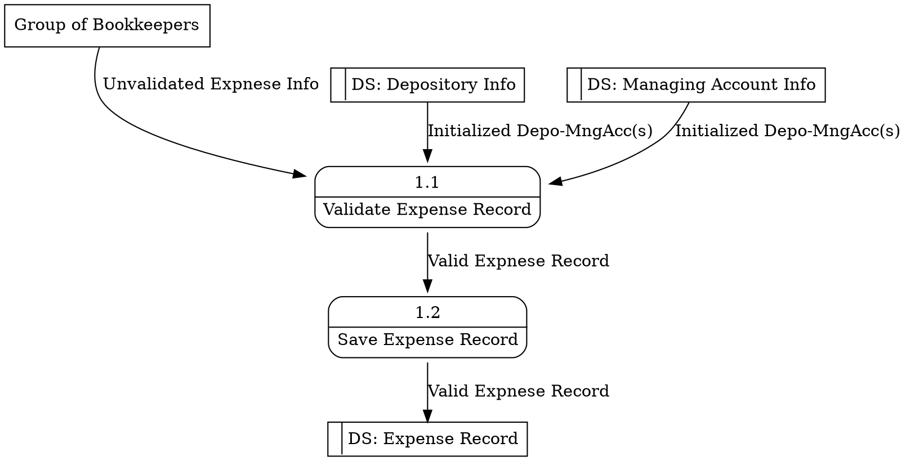
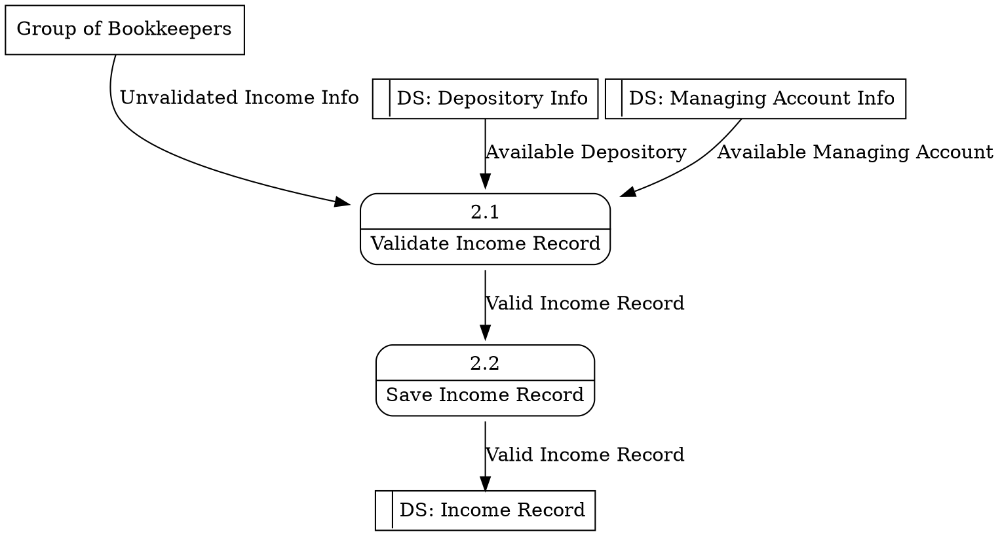
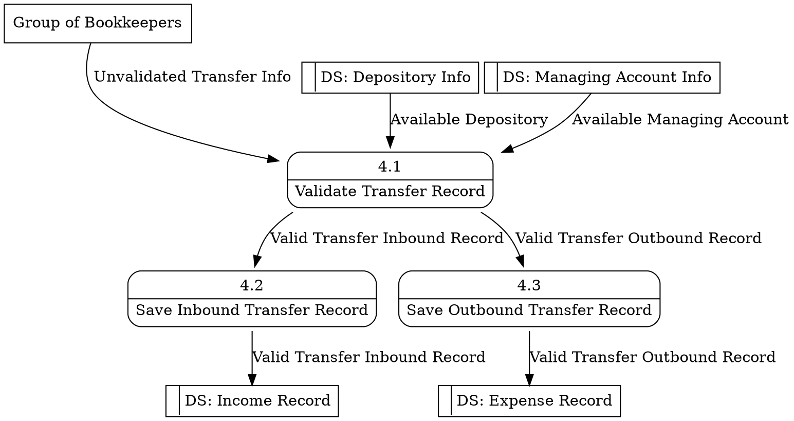
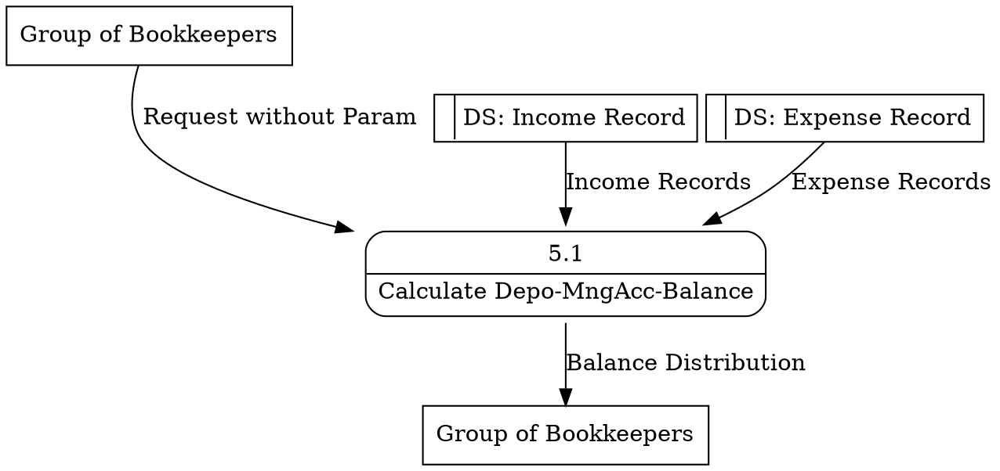

## Feature Name

### Activity Flow

### Description

### Requirement Mapping

---


## Display Total Expense of This Month

---

## Create An Expense Record

### Main Flow

```puml
|User|
start
:Access expense entry form;
|System|
:Display expense entry form;
|User|
repeat
:Fill in the form;
:Submit the form;
|System|
:Validate form data;
repeat while (invalid data?)
:Add an expense record;
:Display operation result;
stop
```

---

## Create An Income Record

### Main Flow

```puml
|User|
start
:Access income entry form;
|System|
:Display income entry form;
|User|
repeat
:Fill in the form;
:Submit the form;
|System|
:Validate form data;
repeat while (invalid data?)
:Add an income record;
:Display operation result;
stop
```

---

## Configure Depository

### Main Flow

```puml
|User|
start
:Access configuration form;
|System|
:Display configuration form;
|User|
repeat
:Fill in the form;
:Submit the form;
|System|
:Validate form data;
repeat while (invalid data?)
if (Same combo of depository & mngAcc exists?) then (yes)
  :Delete the existing entry;
endif
:Add an income record with init type;
:Display operation result;
stop
```

### Description

Transaction entries of a certain depository with transaction date prior than that of depository configuration entry will not be calculated.

### UX State

```puml
title Modification of Depository
[*] --> DepositoryInfoLocked
DepositoryInfoLocked --> DepositoryInfoUnlocked
DepositoryInfoUnlocked --> DepositoryInfoModified
DepositoryInfoUnlocked --> DepositoryInfoLocked
DepositoryInfoModified --> DepositoryInfoLocked
DepositoryInfoLocked --> [*]
DepositoryInfoLocked : Contents - void
```

```puml
title Creation of Depository
[*] --> DepositoryInfoUnlocked
DepositoryInfoUnlocked --> DepositoryInfoCreated
DepositoryInfoCreated --> DepositoryInfoLocked
DepositoryInfoLocked --> [*]
```

```puml
title Deletion of Depository
[*] --> DepositoryInfoLocked
DepositoryInfoLocked --> DepositoryInfoDeleted
DepositoryInfoDeleted --> [*]
```

```puml
title Skeleton Modal State Transition
[*] --> Empty
Empty --> PromptNextOrAbort : Attempt Valid
PromptNextOrAbort --> HintSuccess : Next Action Fulfilled
HintSuccess --> [*]
PromptNextOrAbort --> PromptAbort : Next Action Failed
Empty --> PromptAbort : Attempt Is Not Valid
PromptAbort --> [*]
```

```puml
title Depository Item in Configuration Module
[*] --> Empty
[*] --> Read
Empty --> Edit : add
Edit --> Read : confirm adding
Edit --> Empty : abort adding
Edit --> Read : abort editing
Edit --> Read : confirm editing
Read --> Edit : edit
Read --> Destroyed : delete
Read --> [*]
Destroyed --> [*]
```

## Analysis

### Activity Flow

### Description

1. Current Balance of Each Depository
   1. Balance Distribution by Managing Account
1. Current Balance of Each Managing Account
   1. Balance Distribution by Depository

### Requirement Mapping

---

### DFD

#### Context Diagram

```viz
digraph Context_Diagram{    
        enti1 [label="Group of Bookkeepers" shape=box];          
        proc1 [label=<
          <table style="rounded" CELLBORDER="0" CELLSPACING="4">
            <tr>
              <td>0</td>
            </tr>
            <HR/>
            <tr>
              <td>Bookkeeping System</td>
            </tr>
          </table>
          >,
          shape=none];

        rankdir="LR";
        enti1 -> proc1 [ label = "Expense Record" ];
        enti1 -> proc1 [ label = "Income Record" ];
        enti1 -> proc1 [ label = "Transfer Record" ];
        enti1 -> proc1 [ label = "Depository-Managing Account Configuration" ];
        proc1 -> enti1 [ label = "Balance Distribution" ];
}
```

#### Diagram 0

```dot
digraph Diagram_0{



        ratio="compress"
        node [ fontsize=12 ];
        edge [ fontsize=10 ];

        enti1 [label="Group of Bookkeepers" shape=box];          

        subgraph cluster_system{
          proc1 [label=<
            <table style="rounded" CELLBORDER="0" CELLSPACING="4">
              <tr>
                <td>1</td>
              </tr>
              <HR/>
              <tr>
                <td>Keep Expense Record</td>
              </tr>
            </table>
            >,
            shape=none
          ];
          proc2 [label=<
            <table style="rounded" CELLBORDER="0" CELLSPACING="4">
              <tr>
                <td>2</td>
              </tr>
              <HR/>
              <tr>
                <td>Keep Income Record</td>
              </tr>
            </table>
            >,
            shape=none
          ];
          proc3 [label=<
            <table style="rounded" CELLBORDER="0" CELLSPACING="4">
              <tr>
                <td>3</td>
              </tr>
              <HR/>
              <tr>
                <td>Configure Depository-Managing Account</td>
              </tr>
            </table>
            >,
            shape=none
          ];
          proc4 [label=<
            <table style="rounded" CELLBORDER="0" CELLSPACING="4">
              <tr>
                <td>4</td>
              </tr>
              <HR/>
              <tr>
                <td>Transfer Asset</td>
              </tr>
            </table>
            >,
            shape=none
          ];
          proc5 [label=<
            <table style="rounded" CELLBORDER="0" CELLSPACING="4">
              <tr>
                <td>5</td>
              </tr>
              <HR/>
              <tr>
                <td>Calculate Balance Distribution</td>
              </tr>
            </table>
            >,
            shape=none
          ];

          subgraph cluster_system{
            datastore1[
              shape="plain",
              label=<
                <table CELLBORDER="0" CELLPADDING="4">
                  <tr>
                    <td></td>
                    <vr/>
                    <td>DS: Expense Record</td>
                  </tr>
                </table>
              >
            ];
            datastore2[
              shape="plain",
              label=<
                <table CELLBORDER="0" CELLPADDING="4">
                  <tr>
                    <td></td>
                    <vr/>
                    <td>DS: Income Record</td>
                  </tr>
                </table>
              >
            ];
            datastore3[
              shape="plain",
              label=<
                <table CELLBORDER="0" CELLPADDING="4">
                  <tr>
                    <td></td>
                    <vr/>
                    <td>DS: Depository Info</td>
                  </tr>
                </table>
              >
            ];
            datastore4[
              shape="plain",
              label=<
                <table CELLBORDER="0" CELLPADDING="4">
                  <tr>
                    <td></td>
                    <vr/>
                    <td>DS: Managing Account Info</td>
                  </tr>
                </table>
              >
            ];
          }

        }

        enti1 -> proc1 [ label = "Expense Record" ];
        datastore3 -> proc1 [ label = "Initialized Depo-MngAcc(s)" ];
        datastore4 -> proc1 [ label = "Initialized Depo-MngAcc(s)" ];
        proc1 -> datastore1 [ label = "Expense Record" ];
        enti1 -> proc2 [ label = "Income Record" ];
        datastore3 -> proc2 [ label = "Initialized Depo-MngAcc(s)" ];
        datastore4 -> proc2 [ label = "Initialized Depo-MngAcc(s)" ];
        proc2 -> datastore2 [ label = "Income Record" ];
        enti1 -> proc3 [ label = "Configuration Info" ];
        datastore3 -> proc3 [ label = "Available Depositories" ];
        datastore4 -> proc3 [ label = "Available Managing Accs" ];
        proc3 -> datastore3 [ label = "Depository Info" ];
        proc3 -> datastore4 [ label = "Managing Account Info" ];
        proc3 -> datastore2 [ label = "Depository-Managing Acc Init Record" ];
        enti1 -> proc4 [ label = "Transfer Record" ];
        datastore3 -> proc4 [ label = "Initialized Depo-MngAcc(s)" ];
        datastore4 -> proc4 [ label = "Initialized Depo-MngAcc(s)" ];
        proc4 -> datastore1 [ label = "Transfer Outbound Record" ];
        proc4 -> datastore2 [ label = "Transfer Inbound Record" ];
        enti1 -> proc5 [ label = "Query Request" ];
        datastore1 -> proc5 [ label = "Expense Records" ];
        datastore2 -> proc5 [ label = "Income Records" ];
        proc5 -> enti1 [ label = "Balance Distribution" ];
}
```



#### Diagram 1



#### Diagram 2



#### Diagram 3

```dot
digraph digram_3{

  enti1input [label="Group of Bookkeepers" shape=box];
  proc3_1 [label=<
    <table style="rounded" CELLBORDER="0" CELLSPACING="4">
      <tr>
        <td>3.1</td>
      </tr>
      <HR/>
      <tr>
        <td>Validate Configuration Info</td>
      </tr>
    </table>
    >,
    shape=none
  ];
  proc3_2 [label=<
    <table style="rounded" CELLBORDER="0" CELLSPACING="4">
      <tr>
        <td>3.2</td>
      </tr>
      <HR/>
      <tr>
        <td>Add/Update Depository Entry</td>
      </tr>
    </table>
    >,
    shape=none
  ];
  proc3_3 [label=<
    <table style="rounded" CELLBORDER="0" CELLSPACING="4">
      <tr>
        <td>3.2</td>
      </tr>
      <HR/>
      <tr>
        <td>Add/Update Managing Account Entry</td>
      </tr>
    </table>
    >,
    shape=none
  ];
  proc3_4 [label=<
    <table style="rounded" CELLBORDER="0" CELLSPACING="4">
      <tr>
        <td>3.4</td>
      </tr>
      <HR/>
      <tr>
        <td>Add/Update Depository-Managing Account Init Value</td>
      </tr>
    </table>
    >,
    shape=none
  ];
  dsDepositoryInfo [
    shape="plain",
    label=<
      <table CELLBORDER="0" CELLPADDING="4">
        <tr>
          <td></td>
          <vr/>
          <td>DS: Depository Info</td>
        </tr>
      </table>
    >
  ];
  dsManagingAccountInfo [
    shape="plain",
    label=<
      <table CELLBORDER="0" CELLPADDING="4">
        <tr>
          <td></td>
          <vr/>
          <td>DS: Managing Account Info</td>
        </tr>
      </table>
    >
  ];
  dsIncomeRecord [
    shape="plain",
    label=<
      <table CELLBORDER="0" CELLPADDING="4">
        <tr>
          <td></td>
          <vr/>
          <td>DS: Income Record</td>
        </tr>
      </table>
    >
  ];

  { rank=source; enti1input;}
  enti1input -> proc3_1 [ label="Unvalidated Configuration Info" ];
  dsDepositoryInfo -> proc3_1 [ label="Available Depository" ];
  dsManagingAccountInfo -> proc3_1 [ label="Available Managing Account" ];
  proc3_1 -> proc3_2 [ label="Valid Depository Info" ];
  proc3_2 -> dsDepositoryInfo [ label="Valid Depository Info" ];
  proc3_1 -> proc3_3 [ label="Valid Managing Account Info" ];
  proc3_3 -> dsManagingAccountInfo [ label="Valid Managing Account Info" ];
  proc3_1 -> proc3_4 [ label="Valid Depository-Managing Account Init Value" ];
  proc3_4 -> dsIncomeRecord [ label="Valid Depository-Managing Account Init Value" ];
}
```



#### Diagram 4



#### Diagram 5



###


### Datastore Model

Depository
Key: ownerId::type::simpleHash(displayName + new Date().toISOString())
{
  type: string,
  ownerId: string,
  editorIds: [string],
  viewerIds: [string],
  displayName: string,
  id: string
}


Managing Account
Key: ownerId::type::simpleHash(displayName + new Date().toISOString())
{
  type: string,
  ownerId: string,
  editorIds: string,
  viewerIds: string,
  displayName: string,
  id: string
}
* name = displayName.replace(/\s/g, "_").replace(/\W/g, "").toLowerCase();

Income Record
Key: ownerId::type::transDateTime::hash
{
  type: string,
  ownerId: string,
  editorIds: string,
  viewerIds: string,
  itemName: string,
  itemDesc: string,
  transAmount: number,
  transDateTime: datetime,
  transType: string,
  transIssuer: string,
  depo: string,
  mngAcc: string
}
* testHash(this.itemName + this.itemDesc + this.transAmount + this.depo + this.mngAcc + this.transType)

Expense Record
Key: ownerId::type::transDateTime::hash
{
  type: string,
  ownerId: string,
  editorIds: string,
  viewerIds: string,
  itemName: string,
  itemDesc: string,
  transAmount: number,
  transDateTime: datetime,
  transType: string,
  transIssuer: string,
  depo: string,
  mngAcc: string
}
* testHash(this.itemName + this.itemDesc + this.transAmount + this.depo + this.mngAcc + this.transType)

User
Key: ownerId::type
{
  type: string,
  ownerId: string,
  password: string,
  authType: string,
  displayName: string,
  registeredDateTime: datetime
}
* user email is ownerId

System Config
Key: ownerId::type
{
  type: string,
  ownerId: string
}
* ownerId of System Config is "system"
* type will be "config"

Indexed view
editorView of a user
viewerView of a user


## API SPEC

### /flow/expense/initData

input
{
	"ownerId": string
}

output
{
    "payload": {
        "depos": [
            {
                "displayName": string
                "editorIds": []
                "id": string
                "ownerId": string
                "type": string
                "viewerIds": []
            }
        ],
        "mngAccs": [
            {
                "displayName": string
                "editorIds": []
                "id": string
                "ownerId": string
                "type": string
                "viewerIds": []
            }
        ],
        "userPref": {
            "authType": "email",
            "displayName": "Trista",
            "ownerId": "trista167@gmail.com",
            "password": "password",
            "prefs": {
                "preferredDepo": string
            },
            "registeredDateTime": "2018-02-25T05:39:55.850Z",
            "type": "user"
        }
    },
    "isSuccess": true
    "error": null
}

### /flow/expense/keepRecord

input
{
	"ownerId": string
	"itemName": string
	"itemDesc": string, optional
	"transAmount": number
	"transDateTime": date().toISOString()
	"transType": string, ["expense", "income"]
	"transIssuer": string
	"depo": string, depository id
	"mngAcc": string, managing account id
	"preferredDepo": string, depository id
	"preferredMngAcc": string, depository id
}

output if operation succeded, and input passed all validation
{
    "payload": true,
    "isSuccess": true,
    "error": null
}

output if operation succeded, but input failed any validation
{
    "payload": [validation msg for each invalid input],
    "isSuccess": true,
    "error": null
}

output if operation failed
{
    "payload": null,
    "isSuccess": false,
    "error": system err msg
}

### /config/currentDepoMngAcc

### /config/addDepo

### /config/editDepo

### /config/deletDepo

### /config/addMngAcc

### /config/editMngAcc

### /config/deleteMngAcc


## Log

### Production
Who access what resource at when, and what is the response of the system?
Key conditionals in business logic flow
System error
Request/Response performance

### Development
Input/output of each method
